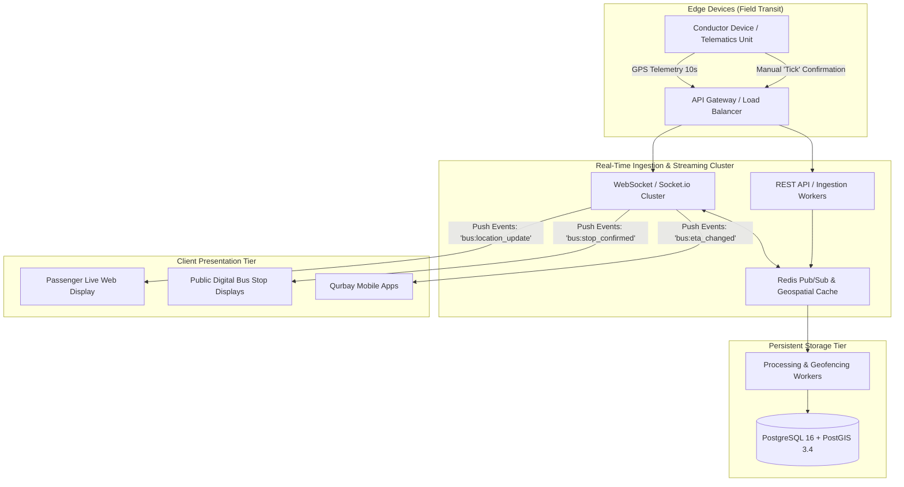
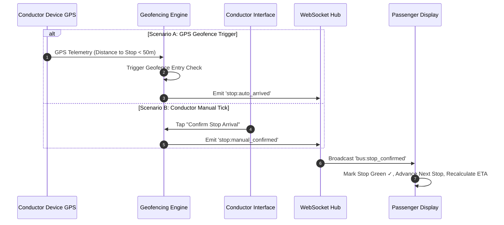

# Live Bus Tracking System — Technical Specifications & System Architecture

This document outlines the end-to-end technical specifications, architecture, data models, real-time synchronization protocols, and error-handling strategies for the Qurbay Live Bus Tracking System.

---

## 1. System Architecture & Technology Stack



### 1.1 Technology Stack Matrix

| Component | Technology | Rationale |
| :--- | :--- | :--- |
| **Frontend Platform** | HTML5, Modern CSS3 (Glassmorphism), Vanilla JS / TypeScript | Zero-overhead, lightning-fast rendering, low-battery consumption on field devices. |
| **Mapping Engine** | Leaflet.js / Mapbox GL JS | High-performance vector tile rendering, smooth sub-second marker interpolation, customizable hardware-accelerated animations. |
| **Real-Time Transport** | WebSocket / Socket.io + BroadcastChannel API | Bidirectional low-latency push messaging (<100ms latency), sub-channel multiplexing, seamless cross-tab browser synchronization. |
| **In-Memory Geo Cache**| Redis 7.2 (with `GEOSEARCH`, `GEOADD`, Pub/Sub) | Sub-millisecond geofence lookups, rate limiting, and real-time state fan-out. |
| **Primary Database** | PostgreSQL 16 with PostGIS 3.4 Extension | Enterprise-grade geospatial queries (`ST_DWithin`, `ST_LineLocatePoint`, `ST_Distance`). |

---

## 2. 10-Second Real-Time Synchronization Protocol

### 2.1 Conductor-to-Server Telemetry Payload (Every 10 Seconds)
```json
{
  "event": "bus:telemetry",
  "data": {
    "busId": "BUS-1102",
    "regNumber": "TN 38 N 2841",
    "routeNumber": "111",
    "conductorId": "C-1048",
    "timestamp": 1756960030,
    "gps": {
      "latitude": 11.076012,
      "longitude": 76.998045,
      "altitudeMeters": 420.5,
      "headingDegrees": 350.2,
      "speedKmh": 34.2,
      "hdop": 0.9
    },
    "activeStopIndex": 6,
    "batteryLevel": 88,
    "networkQuality": "4G_STRONG"
  }
}
```

### 2.2 Server-to-Passenger Broadcast Event
```json
{
  "event": "bus:location_update",
  "data": {
    "busId": "BUS-1102",
    "routeNumber": "111",
    "coordinates": [11.076012, 76.998045],
    "heading": 350.2,
    "speedKmh": 34.2,
    "nextStop": {
      "id": "111_07",
      "title": "Saravanampatti",
      "eta": "13:15",
      "distanceRemainingKm": 1.4,
      "status": "APPROACHING"
    },
    "tripProgress": {
      "completedStops": 6,
      "totalStops": 9,
      "percentage": 66
    },
    "syncTimestamp": 1756960030
  }
}
```

---

## 3. Automatic & Manual Stop Progression Flow



---

## 4. Error Handling & Edge Case Fallback Matrix

| Edge Case | Detection Mechanism | System Fallback Behavior |
| :--- | :--- | :--- |
| **GPS Signal Loss** | No GPS fix for > 15s (`hdop > 5.0` or no satellite lock) | 1. Automatically switch to **Dead-Reckoning Mode**.<br>2. Extrapolate bus position along the known route geometry using speed $v = 30\text{ km/h}$.<br>3. Display yellow status badge `GPS Dead-Reckoning` on public UI. |
| **Conductor Missed Ticking Stop** | Bus GPS coordinates pass stop geofence by > 100 meters | 1. Automatic override marks missed stop as `Passed (Auto-Resolved)`.<br>2. Advances active stop to the next in sequence.<br>3. Logs field alert for telemetry audit. |
| **Bus Going Off-Route** | Perpendicular distance from route polyline $> 120\text{ meters}$ (`ST_Distance(bus_pt, route_geom) > 120`) | 1. Broadcast `ALERT_OFF_ROUTE` event.<br>2. Display red banner on passenger screen: *Route Recalibration Active*.<br>3. Freeze ETA countdown until vehicle rejoins assigned corridor. |
| **Network Loss / Offline Mode** | Network fetch fails or socket disconnects | 1. Conductor app queues stop confirmations and telemetry locally in `IndexedDB`/`LocalStorage`.<br>2. Shows amber indicator: *Offline (Queued)*.<br>3. Once connected, automatically replays queued updates with monotonic timestamps. |

---

## 5. PostgreSQL + PostGIS Database Schema

```sql
-- 1. Routes Table
CREATE TABLE transit_routes (
    route_id VARCHAR(32) PRIMARY KEY,
    route_number VARCHAR(16) NOT NULL,
    route_name VARCHAR(128) NOT NULL,
    start_point VARCHAR(64) NOT NULL,
    end_point VARCHAR(64) NOT NULL,
    route_geometry GEOMETRY(LineString, 4326) NOT NULL,
    total_distance_km NUMERIC(5,2) NOT NULL,
    color_hex VARCHAR(8) DEFAULT '#3B63F6',
    created_at TIMESTAMP WITH TIME ZONE DEFAULT NOW()
);

-- 2. Bus Stops Table
CREATE TABLE route_stops (
    stop_id VARCHAR(32) PRIMARY KEY,
    route_id VARCHAR(32) REFERENCES transit_routes(route_id) ON DELETE CASCADE,
    stop_sequence INT NOT NULL,
    stop_name VARCHAR(128) NOT NULL,
    location GEOMETRY(Point, 4326) NOT NULL,
    scheduled_dwell_seconds INT DEFAULT 45,
    distance_from_start_km NUMERIC(5,2) NOT NULL,
    UNIQUE (route_id, stop_sequence)
);

-- 3. Live Active Bus Trips Table
CREATE TABLE active_bus_trips (
    trip_id UUID PRIMARY KEY DEFAULT gen_random_uuid(),
    bus_id VARCHAR(32) NOT NULL,
    route_id VARCHAR(32) REFERENCES transit_routes(route_id),
    conductor_id VARCHAR(32) NOT NULL,
    current_stop_index INT DEFAULT 0,
    current_location GEOMETRY(Point, 4326),
    current_speed_kmh NUMERIC(4,1) DEFAULT 0,
    current_heading NUMERIC(4,1) DEFAULT 0,
    trip_status VARCHAR(24) DEFAULT 'ON_TIME', -- 'ON_TIME', 'APPROACHING', 'DELAYED', 'OFF_ROUTE'
    last_sync_time TIMESTAMP WITH TIME ZONE DEFAULT NOW()
);

-- Spatial Indices for Ultra-Fast Search
CREATE INDEX idx_stops_location ON route_stops USING GIST(location);
CREATE INDEX idx_route_geom ON transit_routes USING GIST(route_geometry);
CREATE INDEX idx_active_bus_loc ON active_bus_trips USING GIST(current_location);
```
